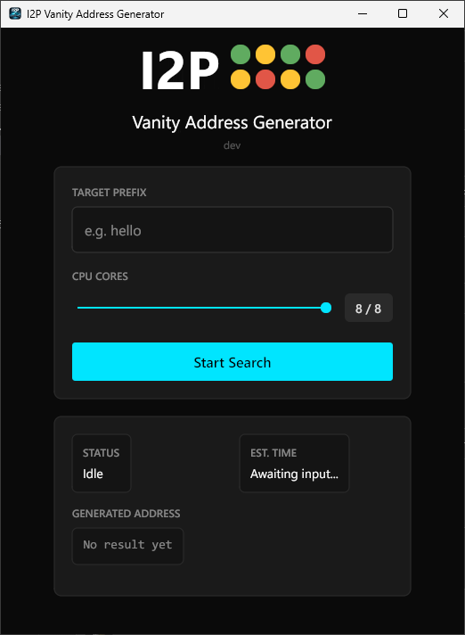
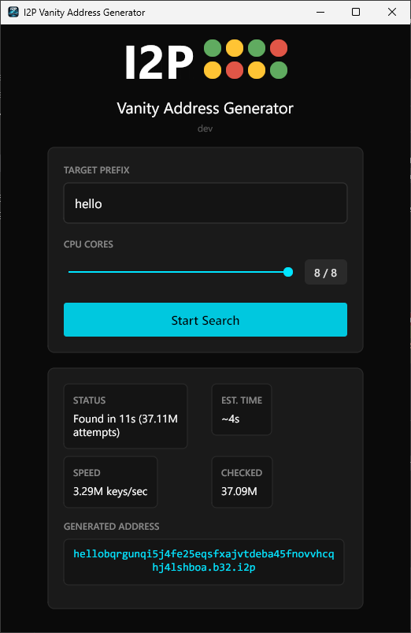

# I2P Vanitygen

A cross-platform desktop application for generating vanity I2P addresses with custom prefixes.

Instead of accepting a randomly generated `.b32.i2p` address, search for one that starts with a meaningful prefix like `hello`, `stormy`, or `secure`.

<p align="center">
  
  &nbsp;&nbsp;
  
</p>

## Features

- **Parallel key generation** — uses all available CPU cores for maximum speed (~500K keys/sec per core)
- **Real-time progress** — live speed, checked count, and estimated time to find a match
- **Auto-update** — checks for new releases on GitHub and updates in-place
- **Code signed** — all platform binaries are signed and verifiable
- **Dark mode UI** — clean, modern interface built with [Gio](https://gioui.org)
- **Privacy-first** — optional anonymous telemetry with explicit opt-in

## Download

Grab the latest release for your platform from [Releases](https://github.com/StormyCloudInc/i2p-vanitygen/releases/latest).

| Platform | Architecture | File |
|----------|-------------|------|
| Windows | x86_64 | `i2p-vanitygen-windows-amd64.exe` |
| macOS | Apple Silicon | `i2p-vanitygen-darwin-arm64` |
| macOS | Intel | `i2p-vanitygen-darwin-amd64` |
| Linux | x86_64 | `i2p-vanitygen-linux-amd64` |

All binaries are code signed:
- **Windows** — Authenticode (right-click → Properties → Digital Signatures)
- **macOS** — Notarized by Apple
- **Linux** — Detached PKCS#7 signature (`.p7s` file)

## Usage

1. Launch the application
2. Enter your desired prefix (valid characters: `a-z`, `2-7`)
3. Adjust the CPU cores slider
4. Click **Start Search**
5. When a match is found, click **Save Keys** to export the private keys

The exported `.dat` file contains your I2P destination and private keys. Keep it safe — anyone with this file can operate the corresponding hidden service.

### How long will it take?

Each additional character in the prefix increases the search space by 32x:

| Prefix Length | Expected Time (8 cores) |
|:---:|---|
| 1 | Instant |
| 2 | Instant |
| 3 | ~8 seconds |
| 4 | ~4 minutes |
| 5 | ~2 hours |
| 6 | ~3 days |
| 7 | ~86 days |

## Build from Source

**Requirements:** Go 1.24+

```bash
# Clone
git clone https://github.com/StormyCloudInc/i2p-vanitygen.git
cd i2p-vanitygen

# Build (dev version)
go build -o i2p-vanitygen .
```

### Platform-specific builds

**Windows** (includes GUI subsystem flag and embedded resources):
```bash
go install github.com/tc-hib/go-winres@latest
go-winres make
GOOS=windows GOARCH=amd64 CGO_ENABLED=0 \
  go build -ldflags "-H=windowsgui -s -w" -o i2p-vanitygen.exe .
```

**Linux** (requires Gio dependencies):
```bash
sudo apt-get install -y gcc pkg-config libwayland-dev libx11-dev \
  libx11-xcb-dev libxkbcommon-x11-dev libgles2-mesa-dev \
  libegl1-mesa-dev libffi-dev libxcursor-dev libvulkan-dev

GOOS=linux GOARCH=amd64 CGO_ENABLED=1 \
  go build -ldflags "-s -w" -o i2p-vanitygen .
```

**macOS:**
```bash
GOOS=darwin GOARCH=arm64 CGO_ENABLED=1 \
  go build -ldflags "-s -w" -o i2p-vanitygen .
```

## How It Works

The generator creates I2P destinations using Ed25519 signing keys and checks if the resulting base32 address starts with the target prefix. Each CPU core runs an independent search loop, mutating the encryption key via a counter to produce different destination hashes without regenerating the full key pair each time.

When a match is found, the destination (391 bytes) and private keys are saved to a `.dat` file compatible with I2P router software.

## Configuration

Settings are stored in `~/.config/i2p-vanitygen/config.json`:

- **Telemetry** — anonymous metrics (prefix length, duration, core count, attempts). No personal data, keys, or addresses are ever sent. Opt-in only.
- **Update preferences** — skipped version tracking for the auto-updater.

## License

[MIT](LICENSE) — Copyright 2026 StormyCloud Inc
